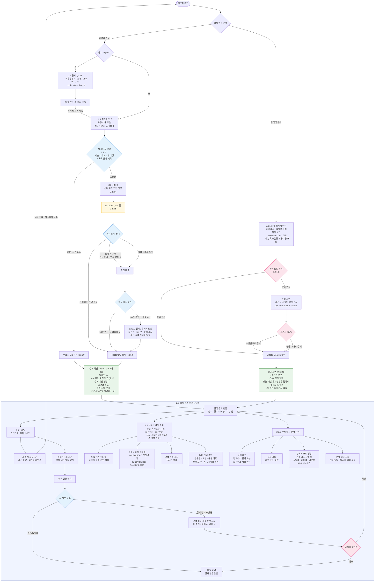

---
aliases:
  - PatSol 특허 검색 IA 흐름도 v0.1
작성일: 2026-03-03
수정일: 2026-03-03
상태: 초안
tags:
  - spec
  - search
  - wip
관련문서:
  - "[[ia_spec-v0.1]]"
  - "[[wireframe-ascii]]"
상위문서: "[[ia_spec-v0.1]]"
---

# PatSol 특허 검색 IA 흐름도 (v0.1)

> 원본: [[ia_spec-v0.1]] · [[wireframe-ascii]]
> 범위: 검색 방식 선택 → 검색 입력 → 검색 결과 전체

---

---

## 결과 화면 비교

| 구분 | 자연어 A / B-1 / B-2 (통합) | 검색식 |
|---|---|---|
| 레이아웃 | 검색결과(좌) · 사이드바(우: 분석대상+채팅) | 동일 |
| 검색 헤더 | 입력 쿼리 요약 | 실행된 검색식 |
| 챗봇 패널 검색 의도 | 자연어 요약 (Q&A 대화 맥락 포함) | 실행된 검색식 |
| 유사도 % | 있음 | 없음 |
| AI 추천 토픽 카드 | 있음 (검색 결과 기반 생성) | 없음 |
| 조건별 분포 | 있음 | 있음 |
| 등록 상태 뱃지 | 있음 | 있음 |
| 선행기술로 저장 | 있음 | 있음 |

## 경로 진입 조건 요약

| 경로 | 진입 조건 | 검색 엔진 | spec 항목 |
|---|---|---|---|
| 검색식 | 검색식 직접 입력 | Elastic Search | 2.2.1 |
| 경로 A | 자연어 충분 | Vector DB Top 50 | 2.2.2.2 → 2.2.2.3 |
| 경로 B-1 | 자연어 불충분 → 토픽 선택 → 예상 50건 이하 | Vector DB Top 50 | 2.2.2.4 → 2.2.2.6 |
| 경로 B-2 | 자연어 불충분 → 토픽 선택 → 예상 50건 초과 | Vector DB Top 50 | 2.2.2.7 → 2.2.2.6 |

## OQ 결정 현황

| OQ | 상태 | 결정 내용 |
|---|---|---|
| OQ-1 | ✅ 결정 | 검색창 자동 채움 (현행 서비스) |
| OQ-2 | ✅ 결정 | 대분류/소분류 드롭다운 포함 |
| OQ-3 | ✅ 결정 | 현재 세션만 |
| OQ-3a | ✅ 결정 | AI가 후속 질문 의도 구분 → 검색 범위 조정형이면 CTA 제시 → 사용자 확인 후 결과 재진입 |
| OQ-4 | ✅ 결정 | 정렬 옵션 포함, 유사도순 디폴트 |
| OQ-5 | ✅ 결정 | 페이지네이션 (단위 설정 가능) |
| OQ-6 | ✅ 결정 | PDF 내보내기 |
