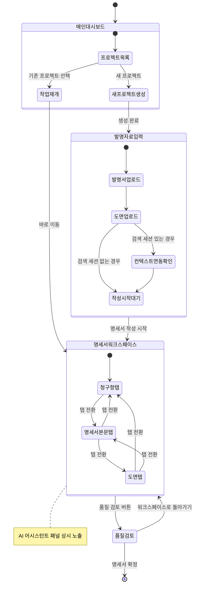
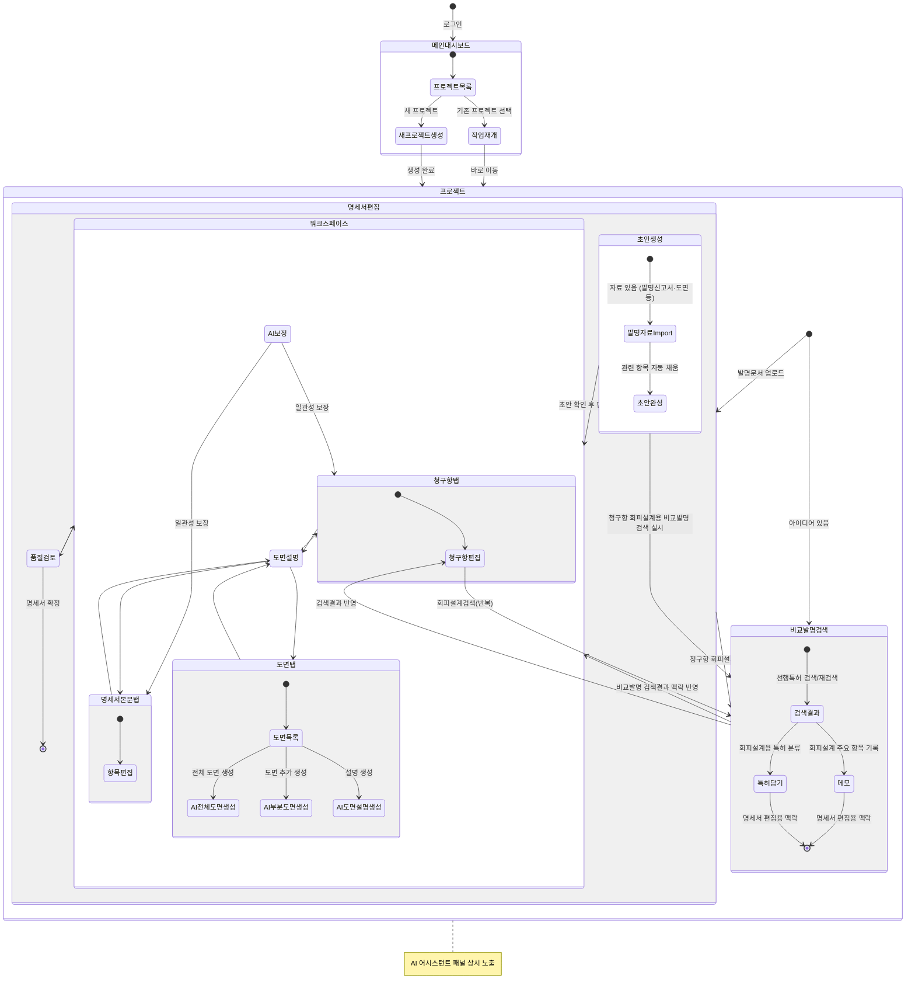
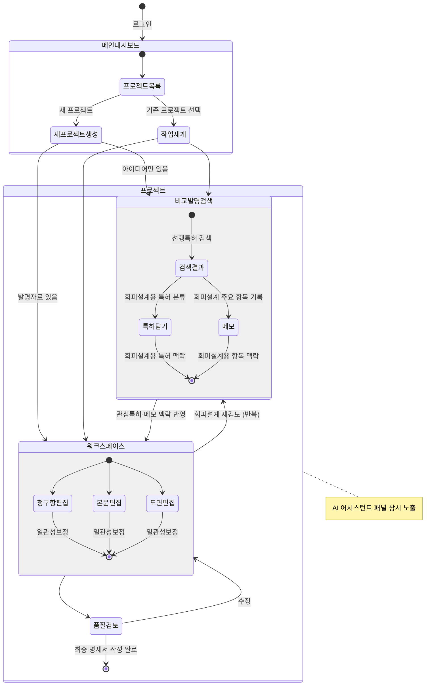
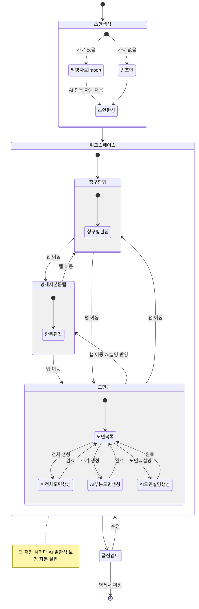

# 페이지별 항목 정의

- 프로젝트 생성
- 비교발명 검색
- 명세서 작성

와이어프레임 작업 전 각 화면에 들어갈 항목을 정리한 문서입니다.

---

## 화면 구조 개요






---

### 개선 버전 — Diagram 1: 프로젝트 레벨 흐름



### 개선 버전 — Diagram 2: 명세서편집 내부 흐름



---

## P1. 진입 / 발명 자료 입력

**목적**: 명세서 작성에 필요한 발명 자료를 수집하고, 검색 세션 컨텍스트를 연동하는 첫 번째 화면

| 영역 | 항목 | 설명 | IA No. |
|---|---|---|---|
| **컨텍스트 배너** | 검색 세션 연동 안내 | 이전 검색 세션에서 수집된 관심특허 N건, 매직노트, AI 채팅 요약이 자동 연동됨을 표시 | 3-1-3 |
| | 연동 컨텍스트 미리보기 | 관심특허 목록 (제목, 출원번호), 검색 의도 요약 | 3-1-3 |
| **발명서 업로드** | 파일 업로드 영역 | Drag & Drop 또는 파일 선택 | 3-1-1 |
| | 지원 형식 안내 | pdf, doc, docx, ppt, pptx, hwp, hwpx | 3-1-1 |
| | 대용량 분할 업로드 | 분할 특허 대응 — 여러 파일 업로드 허용 | 3-1-1-1 |
| **도면 업로드** | 도면 이미지 업로드 | .jpg, .png 등 개별 업로드 가능 | 3-1-2 |
| | 종래기술/본발명 구분 | 업로드 후 AI가 자동 구분, 본발명 도면만 선택됨 (결과 확인 UI 필요) | 3-1-2-1 |
| | 중복 도면 제거 | 동일 도면 감지 시 1건만 유지, 제거 결과 표시 | 3-1-2-2 |
| **진입 액션** | "명세서 작성 시작" 버튼 | P2 워크스페이스로 이동 | — |

**미결 사항**
- 컨텍스트 연동 없이 처음부터 시작하는 경우의 UX (검색 세션 없이 직접 진입)
- 도면 자동 구분 결과를 사용자가 수동 조정할 수 있어야 하는지 여부

---

## P2. 명세서 작성 워크스페이스

**목적**: 청구항·명세서 본문·도면을 탭으로 전환하며 작성하는 메인 편집 공간

### 공통 레이아웃

```
┌─────────────────────────────────────────────────────────┐
│  [프로젝트 정보 바]  세션명  |  단계표시  |  품질검토 버튼  │
├──────────────────────────────────────┬──────────────────┤
│  [탭]  청구항  |  명세서 본문  |  도면  │  AI 어시스턴트   │
│                                      │                  │
│  [에디터 영역]                        │  [채팅 스레드]    │
│                                      │                  │
│                                      │  [입력창]        │
└──────────────────────────────────────┴──────────────────┘
```

### 공통 — 프로젝트 정보 바

| 항목 | 설명 | IA No. |
|---|---|---|
| 세션 제목 | 현재 명세서 작업 제목 (더블클릭 편집 가능) | — |
| 워크플로우 단계 표시 | 검색 → **명세서 작성** → 완료 (현재 단계 강조) | — |
| 품질 검토 버튼 | P3 품질 검토 뷰로 전환 | 3-6 |
| 버전 이력 버튼 | 버전 목록 드롭다운 또는 패널 열기 | 3-8-1 |

---

### P2-A. 청구항 탭

**목적**: 독립항/종속항 작성 및 AI 보조

| 영역 | 항목 | 설명 | IA No. |
|---|---|---|---|
| **청구항 목록** | 청구항 리스트 | 독립항 / 종속항 구분 표시, 순서 변경 가능 | 3-2-1 |
| | 청구항 수 조절 | 생성할 청구항 수 설정 (독립항만 생성 옵션 포함) | 3-2-1-1 |
| **에디터** | 인라인 편집 | 청구항 클릭 → 직접 편집 | 3-2-1 |
| | 문체 규칙 위반 표시 | 규칙에 맞지 않는 표현 인라인 하이라이트 | 3-2-1-2 |
| **AI 지원** | 챗봇 표현 추천 칩 | 편집 중 더 나은 표현 인라인 제안 (수락/무시) | 3-2-2-1 |
| **액션** | AI 청구항 생성 버튼 | 발명 자료 기반 청구항 초안 자동 생성 | 3-2-1 |
| | 내보내기 | 청구항만 별도 복사/다운로드 | — |

**미결 사항**
- 청구항 간 종속 관계 시각화 방식 (트리 vs 인덴트)
- 문체 규칙 위반 강조 표시 수준 (에러 vs 경고)

---

### P2-B. 명세서 본문 탭

**목적**: 발명의 상세한 설명, 도면의 간단한 설명 등 본문 항목 작성

| 영역 | 항목 | 설명 | IA No. |
|---|---|---|---|
| **섹션 네비게이션** | 본문 항목 목록 | 기술분야 / 배경기술 / 해결과제 / 해결수단 / 효과 / 도면설명 / 발명의 상세한 설명 (실시예) | — |
| **에디터** | 섹션별 인라인 편집 | 각 항목 클릭 → 편집 모드 | 3-3 |
| **실시예 생성** | AI 실시예 생성 버튼 | 청구항 기반 실시예 자동 생성 | 3-3-1 |
| | 누락 항목 알림 | 실시예 생성 후 빠진 구성요소 알림 칩 | 3-3-1-1 |
| | 실시예 조합 자동 생성 | 구성요소 조합별 실시예 생성 옵션 | 3-3-1-2 |
| | 실험 데이터 입력창 | 실험 데이터 기반 실시예 추천용 입력 | 3-3-1-3 |
| | 화학 단위 입력 지원 | 화학식/단위 입력 전용 키패드 또는 지원 | 3-3-1-4 |
| **도면 설명 작성** | 참조번호-구성요소 매칭 입력창 | 도면 참조번호 ↔ 구성요소 명칭 대응 테이블 | 3-3-2-1 |
| | AI 도면 설명 생성 버튼 | 업로드 도면 기반 설명 자동 생성 | 3-3-2-2 |

**미결 사항**
- 섹션 네비게이션 방식 (좌측 사이드바 vs 상단 앵커 링크)
- 실시예 조합 생성 결과를 한 번에 보여주는 방식 (카드 vs 탭)

---

### P2-C. 도면 탭

**목적**: 업로드 도면 확인, AI 도면 생성, 도면-명세서 일관성 관리

| 영역 | 항목 | 설명 | IA No. |
|---|---|---|---|
| **도면 목록** | 도면 썸네일 그리드 | 업로드/생성된 도면 목록 | 3-4-1 |
| | 도면 상세 보기 | 클릭 시 확대 + 설명 텍스트 표시 | 3-4-1 |
| **AI 도면 생성** | 생성 유형 선택 | 구성 블록도 / 흐름도 / 구조도·기구도 / 단면도·확대도 / UI 화면도 | 3-4-2-1 |
| | 설명 텍스트 생성 버튼 | 도면 생성 전 충분한 설명 텍스트 AI 생성 | 3-4-2-2 |
| | 도면 생성 실행 버튼 | 설명 텍스트 기반 도면 생성 | 3-4-2 |
| **일관성 검토** | 도면 수정 제안 (텍스트) | 명세서 본문 변경 시 관련 도면 설명 수정 제안 뱃지 | 3-4-3-1 |
| | 도면 수정 제안 (이미지) | 도면 이미지 자체 수정 제안 (검토 후 수락/거절) | 3-4-3-2 |

**미결 사항**
- AI 도면 생성 결과물 품질 기준 및 재생성 UX
- 도면 수정 제안 알림 표시 위치 (뱃지 vs 인라인 팝업)

---

## 공통 패널 — AI 어시스턴트

**목적**: 명세서 작성 전 과정에서 상시 접근 가능한 챗봇 패널

| 영역 | 항목 | 설명 | IA No. |
|---|---|---|---|
| **상태 표시** | 현재 AI 작업 상태 | 응답 중 / 완료 / 대기 구분 표시 | 3-5-1 |
| | 현재 참조 컨텍스트 표시 | AI가 보고 있는 섹션/탭 명시 (ex. "청구항 1항 편집 중 기준") | 3-5-1-2 |
| **대화 스레드** | 채팅 스레드 조회 | 마크다운 렌더링 | 3-5-1-1 |
| | 명세서 반복 수정 응답 | 수정 방향 제안 → 사용자 수락 시 해당 섹션 자동 반영 | 3-5-1-1 |
| **입력** | 멀티라인 입력창 | Enter 줄바꿈 / Ctrl+Enter 전송 | 3-5-1 |
| | 보내기 버튼 | — | 3-5-1 |
| **패널 컨트롤** | 패널 접기/펼치기 | — | — |
| | 패널 폭 조절 | 드래그로 좌우 비율 조정 | — |

---

## P3. 품질 검토 뷰

**목적**: 명세서 완성 전 기재불비·일관성·스타일 종합 점검

| 영역 | 항목 | 설명 | IA No. |
|---|---|---|---|
| **기재불비 체크** | 항목별 점검 결과 리스트 | KIPO 심사기준 기반 위반 항목, 심각도(오류/경고) 구분 | 3-6-1 |
| | KIPO 심사기준 컨설팅 | 항목 클릭 시 관련 심사기준 설명 + 수정 가이드 | 3-6-1-1 |
| **항목 간 일관성** | 일관성 이슈 목록 | 청구항 ↔ 본문 ↔ 도면 간 불일치 항목 | 3-6-2 |
| | 연관 항목 자동 수정 제안 | 불일치 항목 클릭 → 수정 제안 + 수락/거절 | 3-6-2-1 |
| | 최근 수정 이력 | 최근 변경 섹션 목록, 미반영 연관 항목 알림 | 3-6-2-2 |
| **스타일 설정** | 명세서 스타일 선택 | 특허사무소별 스타일 템플릿 선택 드롭다운 | 3-7-1-1 |
| | 선호 표현 등록 | 치환 규칙 추가 (예: 않다 → 아니하다) | 3-7-2-1 |
| | 유사 단어 일괄 치환 실행 | 등록된 규칙 기반 전체 문서 치환 | 3-7-2-2 |
| **액션** | 검토 완료 / 명세서 확정 버튼 | 최종 확정 처리 | — |
| | 워크스페이스로 돌아가기 | P2로 복귀 | — |

**미결 사항**
- P3를 별도 페이지로 분리할지, P2 내 오버레이 패널로 처리할지 여부
- 스타일 학습 기능 (사용자 과거 명세서 업로드 기반) UX 진입점 위치

---

## 항목 요약 매트릭스

| 페이지 | 핵심 컴포넌트 | 우선순위 | IA 범위 |
|---|---|---|---|
| P1. 진입 / 발명 자료 입력 | 파일 업로드, 도면 처리, 컨텍스트 연동 | High | 3-1 |
| P2-A. 청구항 탭 | 청구항 에디터, 문체 규칙, AI 표현 추천 | High | 3-2 |
| P2-B. 명세서 본문 탭 | 섹션 에디터, 실시예 생성, 도면 설명 | High | 3-3 |
| P2-C. 도면 탭 | 도면 뷰어, AI 도면 생성, 일관성 제안 | Medium | 3-4 |
| 공통. AI 어시스턴트 패널 | 챗봇 스레드, 컨텍스트 표시, 입력창 | High | 3-5 |
| P3. 품질 검토 뷰 | 기재불비 체크, 일관성, 스타일 설정 | Medium | 3-6, 3-7 |

---

## 미결 사항 모음 (OQ)

| # | 항목 | 관련 페이지 |
|---|---|---|
| OQ-1 | 검색 세션 없이 명세서 작성 직접 진입 시 UX | P1 |
| OQ-2 | 도면 종래기술/본발명 자동 구분 결과 수동 조정 필요 여부 | P1 |
| OQ-3 | 청구항 종속 관계 시각화 방식 (트리 vs 인덴트) | P2-A |
| OQ-4 | 문체 규칙 위반 강조 수준 (에러 vs 경고) | P2-A |
| OQ-5 | 섹션 네비게이션 방식 (좌측 사이드바 vs 상단 앵커 링크) | P2-B |
| OQ-6 | 실시예 조합 결과 표시 방식 (카드 vs 탭) | P2-B |
| OQ-7 | AI 도면 생성 결과 재생성 UX | P2-C |
| OQ-8 | 도면 수정 제안 알림 표시 위치 (뱃지 vs 인라인 팝업) | P2-C |
| OQ-9 | P3 품질 검토를 별도 페이지로 분리할지 P2 내 오버레이로 처리할지 여부 | P3 |
| OQ-10 | 스타일 학습 기능 (사용자 과거 명세서 업로드) 진입점 위치 | P3 |
